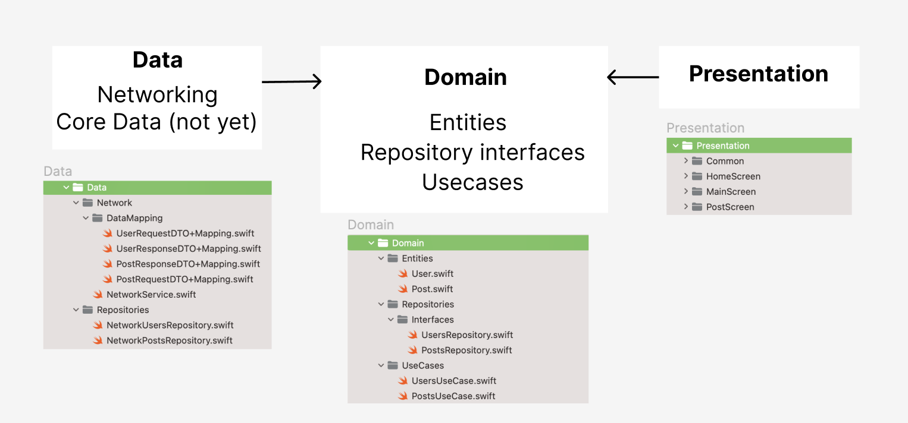

# SmileBlog

## 블로그

12월 25일 User, Post CRUD 기능이 구현된 상태이고, 댓글이나, 이미지, 페이지네이션 등의 아직 구현하지 않은 기능들은 차근차근 공부하며 구현해 나갈 예정입니다.
 Clean architecture를 공부해서 적용시켜보고자 했고, 서버 역시 이왕이면 Swift언어를 사용하여 구현해보았습니다.
 기타 구현된 기능, 구현안된 기능들은 README 제일 아래에 정리해두었습니다.

### 리뷰 관련
Data - Networking - NetworkService.swift 에서 서버와 통신하는 코드들을 중점적으로 리뷰 받고 싶습니다. 들어오는 타입에 따라 공통적으로 사용할 수 있게 Generic을 최대한 활용하여 fetch, create, search 메서드를 만들어 보았습니다.

또한 아키텍쳐 부분에서도 리뷰를 받고 싶습니다. 여러 Clean architecture 오픈 소스들을 참고해서 최대한 깔끔하게 구현하려고 노력했었습니다. 하지만 아직까지 언제 사용해야할지, 어떤 부분에서 이점이 있는지에 대해 잘 와닿지가 않습니다. 아직은 clean architecture에 대한 공부 보다는 그냥 구현을 하면서 아키텍쳐의 필요성에 대해 느끼는 과정이 필요한건지 궁금합니다!

## 기술 스택

### iOS

- Swift
- UIKit

### Server

- Swift
- Vapor

## 아키텍쳐

최대한 깔끔한 구조로 프로젝트를 구현해보고 싶어서 Github의 Clean architecture 코드들을 참고했습니다.

## 기능

- [x] 블로그 포스트 생성
- [x] 블로그 포스트 읽기
- [x] 블로그 포스트 삭제
- [x] 블로그 포스트 수정

## Next Step

- [ ] 댓글 기능
- [ ] 임시 저장 기능
- [ ] Pagination 기능
- [ ] 이미지 포스팅 기능
- [ ] 블로그 포스트 날짜별로 정렬하기
- [ ] 수정 후 수정된 포스트 바로 보여주기
- [ ] 생성 일자가 nil로 나오는 현상 해결하기

## App screens

